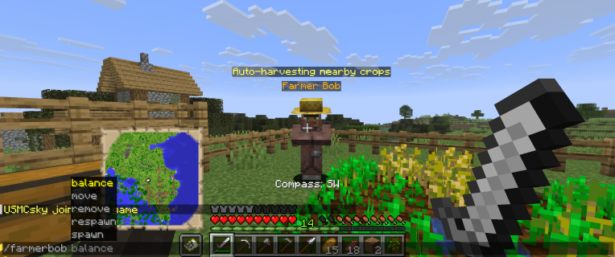
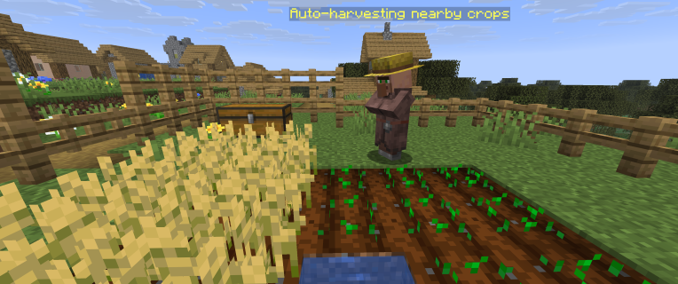
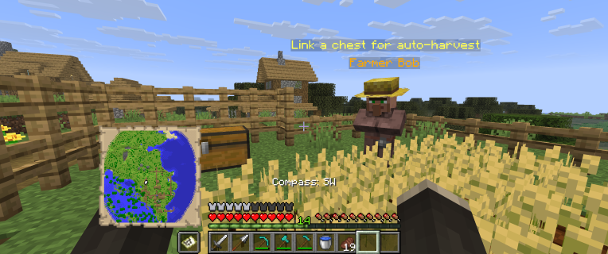
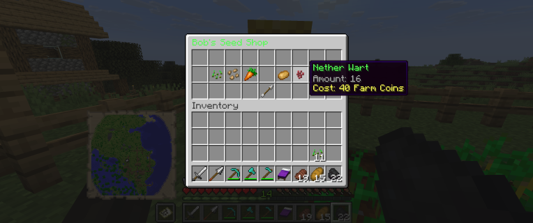
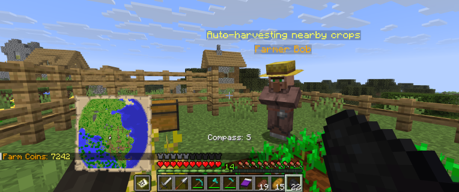
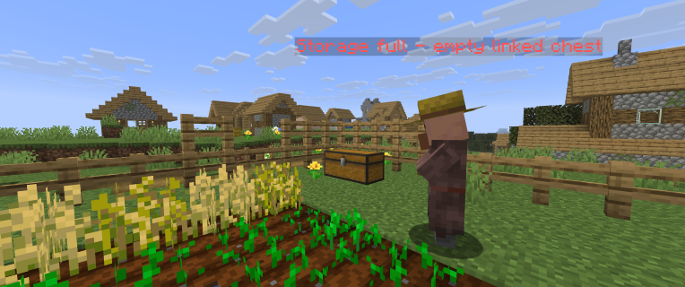

# SkyFarming (Spigot Plugin)

[](https://adoptium.net/)
[](https://www.spigotmc.org/wiki/spigot-plugin-development/)
[](https://github.com/USMCsky/SkyFarming_Spigot_Plugin/commits/master)
[](https://github.com/USMCsky/SkyFarming_Spigot_Plugin)
[](https://github.com/USMCsky)

A Spigot plugin that brings automated farming and coin-based trading to your server through **Farmer Bob** — a personal villager that auto-harvests your crops and buys them for coins.
Perfect for survival and economy servers where players want passive farming income without grinding.

## Features
- Spawn a personal **Farmer Bob** villager tied to your account
- Bob will **automatically harvest** crops in a radius around his location
- **Link Bob to a chest** so harvested crops are deposited automatically
- Trade harvested crops with Bob for **coins**
- Check your **coin balance** at any time
- Bob can be **moved, respawned, or removed** as needed
- **Storage full warning** when Bob's linked chest has no room

## Requirements
- **Minecraft/Spigot API:** `1.21` (as defined in `plugin.yml`)
- **Java:** 21 (recommended based on modern Spigot 1.21 runtime expectations)

## Player Instructions
1. Spawn your personal Farmer Bob:
   ```text
   /farmerbob spawn
   ```
2. Set up your farm and let Bob auto-harvest crops nearby.
3. Link Bob to a chest to collect harvested crops automatically:
   ```text
   /farmerbob link
   ```
4. Trade with Bob to exchange crops for coins:
   ```text
   /farmerbob trade
   ```
5. Check your coin balance:
   ```text
   /farmerbob balance
   ```

### Commands (Players)
- `/farmerbob spawn`  
  Spawn your personal Farmer Bob villager.
- `/farmerbob move`  
  Move Farmer Bob to your current location.
- `/farmerbob respawn`  
  Respawn Farmer Bob if he has been removed or despawned.
- `/farmerbob remove`  
  Remove your Farmer Bob villager.
- `/farmerbob balance`  
  Check your current coin balance.

### Auto-Harvest Behavior
Farmer Bob automatically harvests mature crops within his range:
- Crops are collected and either deposited into his **linked chest** or held until traded.
- If the linked chest is **full**, Bob will warn you with a message and pause depositing until space is available.
- Bob remains persistent and will **respawn** if accidentally killed.

### Trading With Bob
- Approach Bob and use `/farmerbob trade` (or `/bob trade`) to open the trading interface.
- Exchange your harvested crops for **coins**.
- Coin balances are stored per-player and persist across sessions.

## Screenshots

### Farmer Bob Commands
Shows the available command list in chat for managing your personal Farmer Bob.



### Auto-Harvest in Action
Bob automatically harvesting mature crops and collecting them in the field.



### Linking Bob to a Chest
Demonstration of linking Farmer Bob to a chest so harvested crops are deposited automatically.



### Trading With Bob
The trading interface showing crop-to-coin exchanges with Farmer Bob.



### Coin Balance
Checking your current coin balance via command.



### Storage Full Warning
Warning message displayed when Bob's linked chest is full and cannot accept more crops.



---

## Permissions
- `skyfarming.use`  
  Allows usage of Farmer Bob commands.  
  **Default:** `true`

## Admin Notes
- Main command: `farmerbob`
- Alias: `bob`
- Data is stored in `plugins/SkyFarming/` including player coin balances and Bob's location/chest link per player UUID.

## Troubleshooting
- **"Only players can use this command."**
  - Run commands in-game as a player (not from the server console).

- **Bob won't harvest crops**
  - Make sure crops are fully mature and within Bob's range.
  - Try `/farmerbob move` to reposition Bob closer to your farm.

- **"Storage is full."**
  - Clear space in Bob's linked chest or link him to a different chest.

- **Bob has disappeared**
  - Use `/farmerbob respawn` to bring him back.

- **Coins not updating**
  - Try trading again or rejoin the server. If the issue persists, check server logs for plugin errors.
